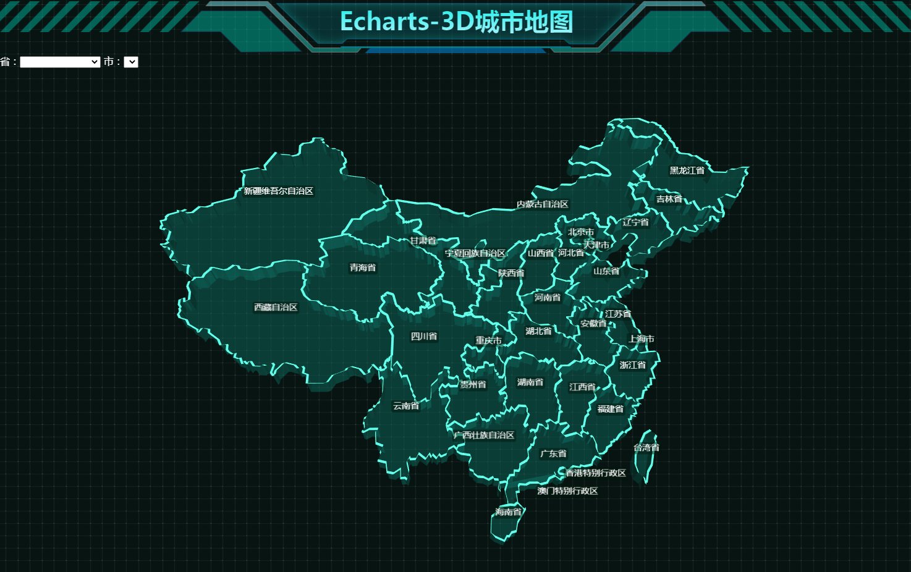
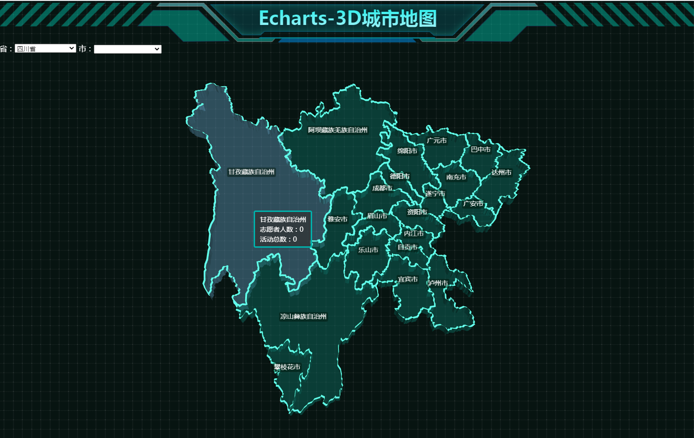
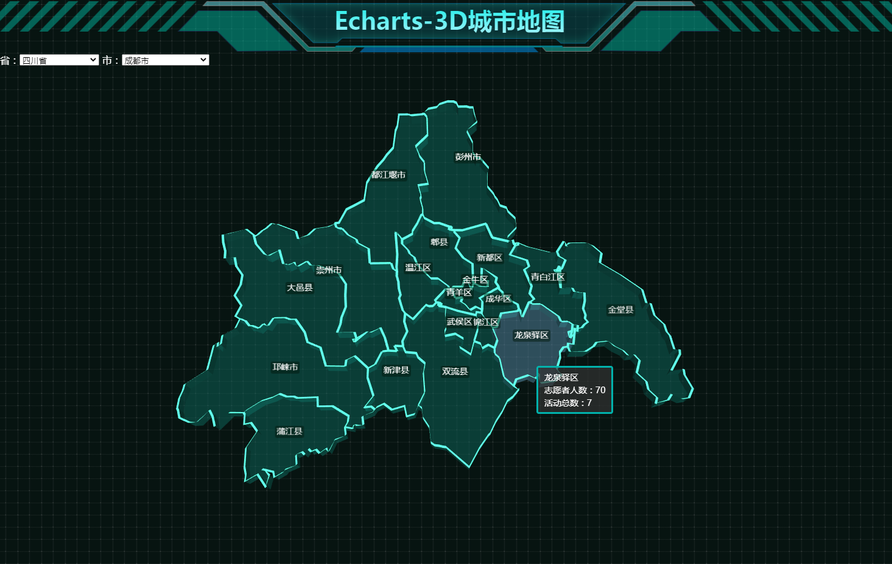

# echarts-demos

> echarts 学习 栗子

## echarts绘制3D城市地图

中国地图/各省地图/市级地图

使用方式相同 唯一的区别是导入不同的 json文件

通过使用 [series-map3D](https://echarts.apache.org/zh/option-gl.html#series-map3D) 可以绘制3D地图


1.需要先下载 echarts-gl.js,并在页面中引入

2.通过json导入地图数据

```$xslt
$.get('map/json/china.json', function (chinaJson) {
    echarts.registerMap('china', chinaJson); // 注册地图
    var chart = echarts.init(document.getElementById('main'));
    chart.setOption({
        series: [{
            type: 'map',
            map: 'china' // 注册的地图名称
        }]
    });
});
```
`/map/`目录下有中国地图以及 各省市的 地图 json文件 `/map/geoCitys.js`是省市关联文件
level代表行政级别
code代表城市编码

地图数据可能不准确 可以自行下载替换
[DATAV](https://datav.aliyun.com/tools/atlas/#&lat=30.332329214580188&lng=106.72278672066881&zoom=3.5)

省市区 各级地图展示





